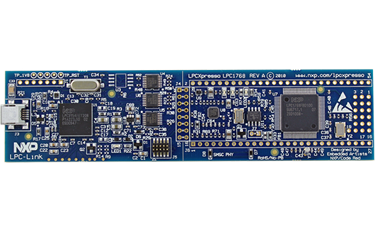
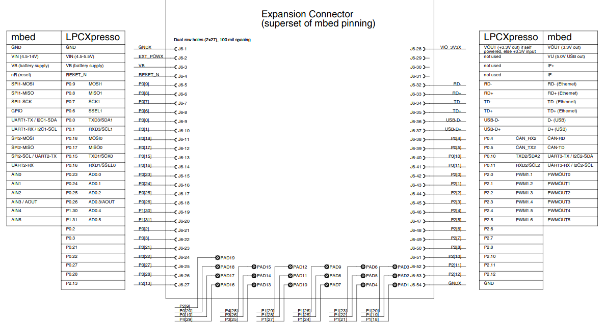
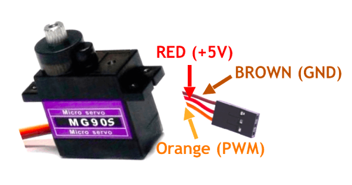

#   servomotor pwm lpc1769 example
Proyecto ejemplo para controlar servomotor MG90 con señal PWM proveniente del periférico de PWM1 del micro controlador LPCXpresso lpc1769.

- IDE: [MCUXpresso IDE](https://www.nxp.com/design/software/development-software/mcuxpresso-software-and-tools-/mcuxpresso-integrated-development-environment-ide:MCUXpresso-IDE).
- Lenguaje: C.
- Microcontrolador: [LPCXpresso lpc1769 rev C](https://www.embeddedartists.com/products/lpc1769-lpcxpresso/).
- Libreria [LPC Open](https://www.nxp.com/design/microcontrollers-developer-resources/lpcopen-libraries-and-examples:LPC-OPEN-LIBRARIES).
- Se agrega a la libreria chip.c -> [pwm1_17xx_40xx.h ](lpc_chip_175x_6x/inc/pwm1_17xx_40xx.h)
- Servomotor [MG90S](https://www.amazon.com/-/es/unids-MG90S-engranaje-helic%C3%B3ptero-Arduino/dp/B07L6FZVT1)
- PWM

---
## LPCXpresso LPC1769
 

## Servo MG90S

---
Autor: @ealegremendoza

E-mail: ealegremendoza@gmail.com
